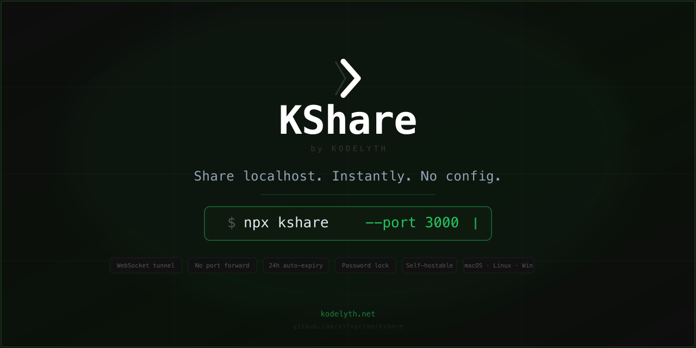
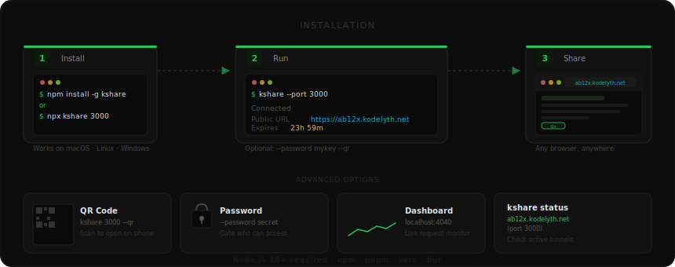
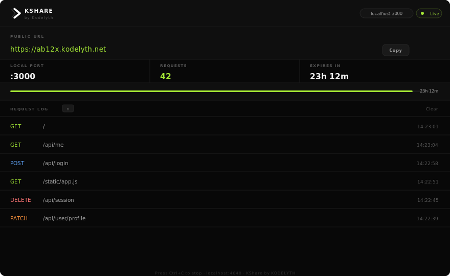
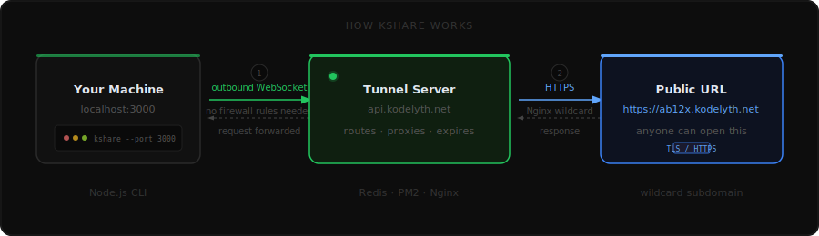

# KShare

**by KODELYTH**

Turn any localhost port into a public HTTPS link — in one command.  
No config, no cloud account, no port forwarding. Just run it.

<p align="center">
  
</p>


---

## What it does

You have a project running on your machine:

```
localhost:3000
```

Run one command:

```bash
npx kshare --port 3000
```

Thirty seconds later, anyone on earth can open your app:

```
  KShare  by KODELYTH

  Connected

  Public URL   https://ab12x.kodelyth.net
  Dashboard    http://localhost:4040
  Expires      23h 59m
  Local        localhost:3000

  Press Ctrl+C to stop
```

The link is HTTPS, it auto-reconnects if your Wi-Fi drops, it rewrites URLs in your app's HTML automatically, and it disappears after 24 hours — no cleanup required.

---

## Install

<p align="center">
  
</p>

```bash
# Install globally (recommended)
npm install -g kshare

# Or run without installing
npx kshare --port 3000
```

Works on macOS, Linux, and Windows. Node 18+ required.

---

## Usage

```bash
# Share any port
kshare --port 3000
kshare --port 5173
kshare --port 8080

# Password-protect the link
kshare --port 3000 --password mysecret

# Show QR code in terminal (mobile testing)
kshare --port 3000 --qr

# View active tunnels on this machine
kshare status

# Stop all running tunnels
kshare stop
```

---

## Why it reconnects

Most tunnel tools give you a new URL every time your network hiccups.  
KShare restores the exact same URL after reconnection — no broken links, no "try refreshing" messages to your stakeholders.

---

## Works with everything

Any app that runs on localhost works without changes:

| Framework | Command |
|-----------|---------|
| React / CRA | `kshare --port 3000` |
| Vite / Vue | `kshare --port 5173` |
| Next.js | `kshare --port 3000` |
| Express / Node | `kshare --port 3000` |
| Django | `kshare --port 8000` |
| Flask | `kshare --port 5000` |
| Laravel | `kshare --port 8000` |
| Rails | `kshare --port 3000` |
| FastAPI | `kshare --port 8000` |
| Spring Boot | `kshare --port 8080` |

---

## Local dashboard

<p align="center">
  
</p>

While a tunnel is active, open [http://localhost:4040](http://localhost:4040) to see live request logs, response times, and tunnel status — no browser extension needed.

---

## How it works

<p align="center">
  
</p>

Outbound WebSocket only. KShare never asks you to open a port or modify a firewall.

When someone hits your public URL:

1. Nginx routes the request to the tunnel server
2. The server sends the request over your open WebSocket
3. Your local KShare CLI forwards it to `localhost:PORT`
4. The response travels back the same way — including full URL rewriting in HTML, CSS, and JS

---

## Self-host

Run your own tunnel server. Full control, your own domain.

### Requirements

- A VPS (1 CPU, 1 GB RAM minimum — a $4/month Hetzner or DigitalOcean box works)
- A domain with wildcard DNS support
- Node 22, Redis, Nginx, PM2

### Quick start

```bash
git clone https://github.com/sifxprime/kshare.git
cd kshare/packages/server

cp .env.example .env
# Fill in BASE_DOMAIN, REDIS_URL, ADMIN_SECRET

pnpm install
pnpm start
```

Full step-by-step guide: [docs/vps-setup.md](docs/vps-setup.md)  
DNS and wildcard SSL: [docs/dns-setup.md](docs/dns-setup.md)

### Point the CLI at your server

```bash
# Permanent (add to shell profile)
export KSHARE_SERVER=wss://api.yourdomain.com

# One-off
KSHARE_SERVER=wss://api.yourdomain.com kshare --port 3000
```

---

## Environment variables (CLI)

| Variable | Default | Description |
|---|---|---|
| `KSHARE_SERVER` | `wss://api.kodelyth.net` | WebSocket server URL |

---

## Environment variables (server)

| Variable | Required | Description |
|---|---|---|
| `BASE_DOMAIN` | Yes | Your domain, e.g. `kodelyth.net` |
| `API_DOMAIN` | No | API subdomain, default `api.BASE_DOMAIN` |
| `REDIS_URL` | No | Redis connection URL, default `redis://127.0.0.1:6379` |
| `ADMIN_SECRET` | Yes | Secret for the admin panel |
| `PORT` | No | Server port, default `4000` |
| `TUNNEL_TTL_HOURS` | No | Tunnel lifetime in hours, default `24` |
| `MAX_TUNNELS_PER_IP` | No | Max concurrent tunnels per IP, default `5` |
| `RATE_LIMIT_MAX_REQUESTS` | No | Max requests per window per IP, default `200` |

---

## Repository structure

```
kshare/
├── packages/
│   ├── cli/          — npm package (what users install)
│   ├── server/       — tunnel server (self-host on a VPS)
│   └── dashboard/    — Next.js homepage + admin panel
├── docker/           — Docker and docker-compose configs
└── docs/             — VPS setup, DNS setup, self-hosting guide
```

---

## Security

KShare is open source. You can read every line of what runs on your machine.

- The CLI makes one outbound WebSocket connection to the tunnel server
- No code is injected into your app
- URL rewriting happens on raw text — no DOM manipulation, no scripts
- Tunnel links expire automatically after 24 hours
- Password-protection is available for sensitive work
- Self-host to keep all traffic on infrastructure you control

See [SECURITY.md](SECURITY.md) for the vulnerability disclosure policy.

---

## Contributing

See [CONTRIBUTING.md](CONTRIBUTING.md).

---

## License

MIT — [KODELYTH](https://kodelyth.com)
